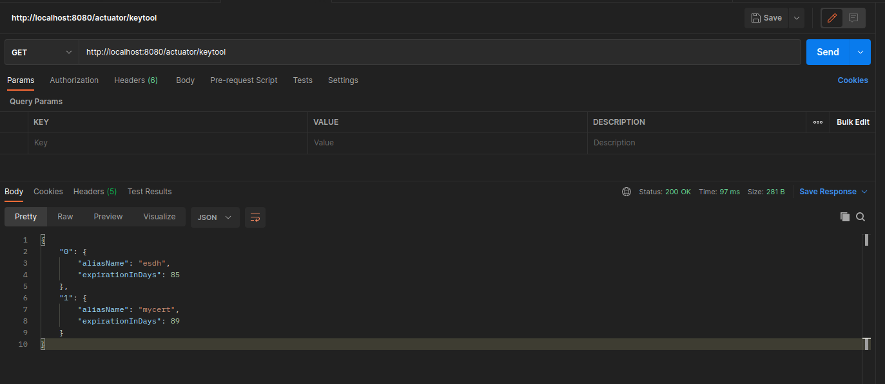

# Проверка просроченных сертификатов

## Описание

Реализация на spring boot с использованием Spring Actuator

Для проверки сертификатов нужно отправить GET запрос на адрес: http://localhost:8080/actuator/keytool

Пример:

